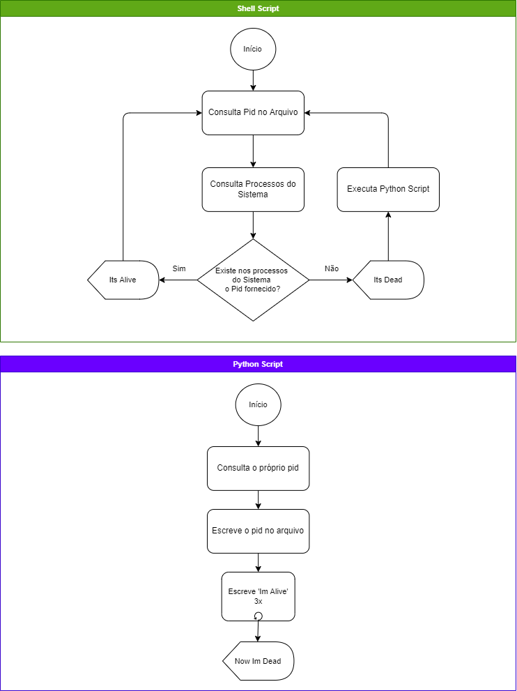

# Case Embarcados

### I.Escreva um modelo conceitual dos dois códigos, por exemplo um diagrama ou um pseudocódigo.



### II. Escreva o código de script shell.

[Shell Script](cromai.sh)

### III. Escreva o código em python3.

[Python3 Script](cromai.py)

### IV. Faça a integração dos dois.

### V. Descreva quais são as diferenças entre o modelo conceitual descrito por você e o que foi implementado.

O modelo conceitual nao aborda as questões específicas da linguagem ou sistema operacional como:
1. A importação dos bibliotecas
2. A utilização dos comandos bash combinados afim de gerar a lógica desejada como o ps com grep, ou então como acessar arquivos com
python e suas variação de modos.
3. A necessidade do .sh rodar em Background o .py afim de gerar o funcionamento esperado.

### VI. Suba seu código no github e nos envie o link.

## Instruções de uso

``` 
docker build -t cromai -f cromai.dockerfile .
docker run -t cromai
```
